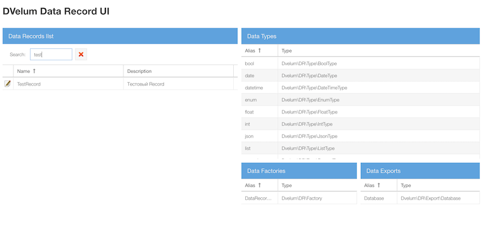
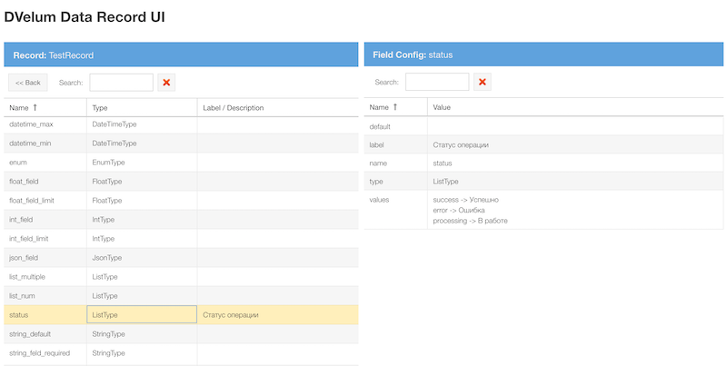

#  DVelum Data Record UI

Интерфейс для просмотра структур Dvelum\DR.

Используется совместно с [DVelum Data Record](https://github.com/dvelum/DR).

Экспериментальный пакет, только для режима разработки.
Поддерживается Linux, MacOS


### Установка

``` composer require --dev dvelum/dr-ui ```

После установки пакета создайте файл конфигурации drui.neon в корневой папке проекта.
Укажите путь к bootstrap файлу, который подключает автозагрузчик и инициализирует ваше приложение.
Укажите путь к registry - конфигурационнный файл реестра объектов Dvelum\DR (возвращает php массив)

```
bootstrap: null #  бутстрап файл вашего приложения
server:
     host: localhost # хост для php cli-server
     port: 8000 # порт для php cli-server
registry: null  # path to registry configuration file
```

Из корня проекта выполните 
```php vendor/bin/drui```

Запустится php cli-server, откройте в браузере  [http://localhost:8000](http://localhost:8000)




